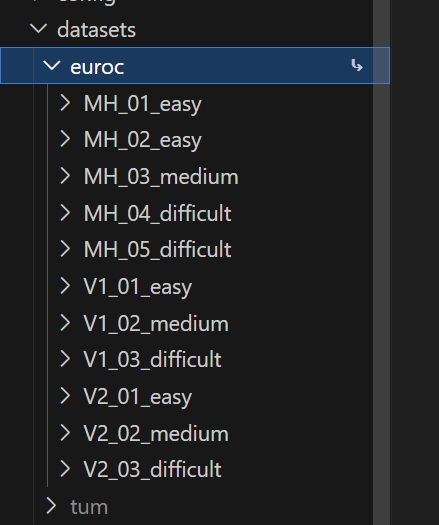

[comment]: <> (# MASt3R-SLAM)

<h1 align="center"> MASt3R-SLAM (复现及中文注释版~仅供个人学习记录用)
</h1>

[comment]: <> ( <h2 align="center">PAPER</h2>)
  <h3 align="center">
  <a href="https://kwanwaipang.github.io/MASt3R-SLAM/" target="_blank">Blog</a> 
  | <a href="https://arxiv.org/pdf/2412.12392" target="_blank">Paper</a>
  | <a href="https://github.com/rmurai0610/MASt3R-SLAM" target="_blank">Original Github Page</a>
  </h3>
  <div align="center"></div>

# 配置过程

```bash
# git clone --recurse-submodules https://github.com/rmurai0610/MASt3R-SLAM.git
# rm -rf .git

conda create -n mast3r-slam python=3.11
conda activate mast3r-slam
# conda remove --name mast3r-slam --all

# 查看cuda版本来决定安装哪个pytorch
nvcc --version

# CUDA 12.1 (12.2应该也是用这个)
conda install pytorch==2.5.1 torchvision==0.20.1 torchaudio==2.5.1 pytorch-cuda=12.1 -c pytorch -c nvidia

#CUDA11.7
conda install pytorch==2.0.1 torchvision==0.15.2 torchaudio==2.0.2 pytorch-cuda=11.7 -c pytorch -c nvidia


pip install -e thirdparty/mast3r
pip install -e thirdparty/in3d
pip install --no-build-isolation -e .

```

# 设置checkpoint
应该就是下载系列的权重文件
```bash
mkdir -p checkpoints/
wget https://download.europe.naverlabs.com/ComputerVision/MASt3R/MASt3R_ViTLarge_BaseDecoder_512_catmlpdpt_metric.pth -P checkpoints/
wget https://download.europe.naverlabs.com/ComputerVision/MASt3R/MASt3R_ViTLarge_BaseDecoder_512_catmlpdpt_metric_retrieval_trainingfree.pth -P checkpoints/
wget https://download.europe.naverlabs.com/ComputerVision/MASt3R/MASt3R_ViTLarge_BaseDecoder_512_catmlpdpt_metric_retrieval_codebook.pkl -P checkpoints/
```

# 下载数据集
此处直接用之前下载的Euroc数据集`/home/gwp/AirIMU/Euroc_dataset`

```bash
# TUM-RGBD Dataset
bash ./scripts/download_tum.sh

# 7-Scenes Dataset
bash ./scripts/download_7_scenes.sh

# EuRoC Dataset
bash ./scripts/download_euroc.sh

# ETH3D SLAM Dataset
bash ./scripts/download_eth3d.sh
```

注意在下载的脚本里面会对数据集进行创建文件夹然后规定命名，比如`euroc`，而代码中会寻找`euroc`来确定是否目标数据集，因此如果下载的数据文件命名不一样，需要修改文件名或者代码~

当然也可以进行软链接:

```bash
ln -s /home/gwp/AirIMU/Euroc_dataset /home/gwp/MASt3R-SLAM/datasets/euroc
```

<div align="center">
  
<figcaption>  
</figcaption>
</div>

# 进行验证
EuRoC Dataset，bash运行的应该就是分别采用带标定参数或者不带标定参数的

```bash
conda activate mast3r-slam
# bash ./scripts/eval_euroc.sh 
# bash ./scripts/eval_euroc.sh --no-calib

# 直接采用py脚本运行不带标定参数的
python main.py --dataset datasets/euroc/MH_01_easy/ --no-viz --config config/eval_no_calib.yaml
```

但是会报错`RuntimeError: CUDA error: no kernel image is available for execution on the device`，也提了[issue](https://github.com/rmurai0610/MASt3R-SLAM/issues/12)